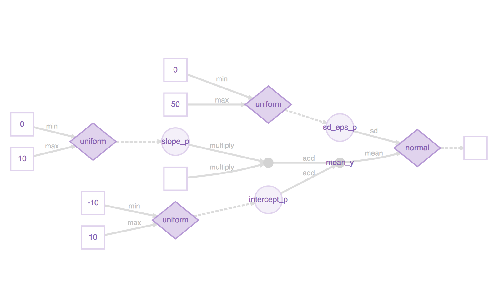

A first foray into probabilistic programming with Greta


## Models and modelling

Much of science - physical and social - is devoted to positing mechanisms that explain how the data we observe are generated. In a classic example, after [Tycho Brahe](https://en.wikipedia.org/wiki/Tycho_Brahe) made detailed observations of planetary motion ([here](http://www.pafko.com/tycho/observe.html) is data on mars), [Johannes Kepler posited laws](https://en.wikipedia.org/wiki/Kepler%27s_laws_of_planetary_motion) of planetary motion that _explained_ how this data were generated. Effectively, **modelling** is the art of constructing data generators that help us understand and predict. 

**Statistical modelling** is one class of models that aims to construct - given some observed data - the probability distribution from which the data were drawn. That is, given a sample of data, a statistical model is a hypothesis about how this data were generated. In practice, this happens in two steps :  
- constructing a hypothesis, or a model $H$ parametrized by some parameters $\theta$  
- finding (_inferring_) the most suitable parameters $\theta$ given the observed data

What parameters are "most suitable" is defined by the [likelihood function](https://en.wikipedia.org/wiki/Likelihood_function) that quantifies how probable the observed data set is, for a given hypothesis parametrized by some particular parameters $H_{\theta}$. Understandably, we want to find parameters such that the observed data is the most likely, this is called [maximum likelihood estimation](https://en.wikipedia.org/wiki/Maximum_likelihood_estimation).

Since any but the simplest models are analytically intractable (i.e., the maximum of the likelihood function needs to be evaluated numerically) it makes sense to construct general rules and syntax to easily define and quickly infer the parameters of statistical models. This is the field of probabilistic programming. 

## Probabilistic programming

The probabilistic programming language (PPL) has two tasks :  

1. be able to construct a useful class of statistical models  
2. be able to infer the parameters of this class of models given some observed data.  

As has been explained in this [excellent paper introducing the PPL Edward](https://www.reddit.com/r/deeplearning/comments/846wb6/the_paper_that_introduces_the_edward_ppl_by/) that is based on Python and [Tensorflow](https://www.tensorflow.org/), some PPLs restrict the class of models they allow in order to optimize the inference algorithm, while other emphasize expressiveness and sacrifice performance of the inference algorithms. Modern PPLs like [Edward](http://edwardlib.org/), [Pyro](https://eng.uber.com/pyro/), and the R based [Greta](https://greta-dev.github.io/greta/index.html) use the robust infrastructure (hardware and software) that was first developed in the context of deep learning and thus ensure scalability and performance while being expressive. 

### The tensor and the computational graph

The fundamental data structure of this group of languages is the [tensor](https://en.wikipedia.org/wiki/Tensor) which is just a multidimensional array. Data, model parameters, samples from distributions are all stored in tensors. All the manipulations that go into the construction of the output tensor constitute the computational graph (see [this](http://colah.github.io/posts/2015-08-Backprop/) for an exceptionally clear exposition of the concept) associated with that tensor.  

Data and parameter tensors are inputs to the computational graph. In the context of deep learning, "training" consists of the following steps :
1. Randomly initializing the parameter tensors  
2. Computing the output  
3. Measuring the error compared to the real/desired output  
4. Tweaking the parameter tensors to reduce the error.  
The algorithm that does this is called [back propagation](https://en.wikipedia.org/wiki/Backpropagation).
Thus, the objective in deep learning or machine learning is to obtain the **best values** of the parameters given some data.

The objective of probabilistic modelling is subtly different. The objective here is to obtain the **distribution** (called **posterior distribution**) of parameters given the data. If we denote the data by $D$, [Bayes theorem](https://en.wikipedia.org/wiki/Bayes%27_theorem) connects (for a particular hypothesis about how the data were generated $H$), the likelihood of the data given some parameters $P(D|\theta,H)$, our prior expectations about how the parameters are distributed $P(\theta)$ and the posterior distribution of the parameters themselves $P(\theta|D,H)$ :
\[
P(\theta|D,H) = \frac{P(D|\theta,H)P(\theta)}{P(D)}.
\]

The priors $P(\theta)$ do not depend on the data and encode "domain knowledge" while and the probability of the data set $P(D)$ is (typically) a high dimensional integral given by
\[
P(D|H) = \int P(D,\theta|H)d\theta.
\]

Intuitively, we want to compute the most likely parameters given the data, i.e. we want to maximize $P(\theta|D,H)$. While maximizing the likelihood can give us the estimates of the "most likely parameters" (in the limit of infinite data), computing the full distribution $P(\theta|D,H)$ involves the computation of the difficult integral for $P(D|H)$.

### Bayesian prediction and MCMC

Prediction in this framework is also fundamentally different from typical machine learning model. The probability of a new data point $d$,
\[
P(d|D,H) = \int P(d|\theta,H)P(\theta|D,H)d\theta,
\]
which consists of the expectation value of the new data point over the whole distribution of parameters given the observed data (the posterior distribution calculated obtained from the solution to the inference problem), instead of a value calculated by plugging in the "learned parameter values" into the machine learning model. 

The integrals needed for inference ($P(D|H) = \int P(D,\theta|H)d\theta$ as well as prediction $P(d|D,H) = \int P(d|\theta,H)P(\theta|D,H)d\theta$ are over the parameter space which can be very high dimensional. This, Markov Chain Monte Carlo methods are used to approximate these integrals. [This](https://www.reddit.com/r/deeplearning/comments/8487xg/very_good_introduction_to_hamiltonian_monte_carlo/) is an excellent overview of modern Hamiltonian Monte Carlo methods while [this](https://www.reddit.com/r/MachineLearning/comments/84fobk/superb_overview_and_motivation_for_monte_carlo/?ref=share&ref_source=link) provides wonderful perspective from the dawn of the field. Both papers are long but eminently readable and highly recommended. 

Clearly then, along with the computational graph to define models, a PPL needs a good MCMC algorithm (or another inference algorithm) to compute the high dimensional integrals needed to infer as well as perform a prediction on a general probabilistic model. 

A broad overview of Bayesian machine learning is available [here (PDF)](http://mlg.eng.cam.ac.uk/zoubin/talks/mit12csail.pdf) and [here](http://fastml.com/bayesian-machine-learning/)


Now, we illustrate some of these points using the simplest possible example, linear regression.

## Basic linear regression. 

We will generate artificial data with known parameters, so that we can check if Greta (the PPL we are using for this article) gets it right later. 

### Generating fake data to fit a model to


```r
length_of_data <- 100
sd_eps <- pi^exp(1)
intercept <- -5.0
slope <- pi
x <- seq(-10*pi, 10*pi, length.out = length_of_data)
y <- intercept + slope*x + rnorm(n = length_of_data, mean = 0, sd = sd_eps)
data <- data_frame(y = y, x = x)
ggplot(data, aes(x = x, y = y)) +
  geom_point() +
  geom_smooth(method = 'lm') +
  ggtitle("Fake experimental data")
```


Given this data, we want to write Greta code to infer the posterior distributions of the model parameters. 

### Defining clueless priors for model parameters

These are the parameters of the model. In this case, they are simple but in principle they can be arbitrary tensors. Since we really don't know anything about the prior distributions of our parameters, we look at the experimental data and take rough, uniform priors. 


```r
intercept_p <- uniform(-10, 10)
sd_eps_p <- uniform(0, 50)
slope_p <- uniform(0, 10)
```


### Defining the model


```r
mean_y <- intercept_p+slope_p*x
```

```
## Error: Installation of TensorFlow not found.
## 
## Python environments searched for 'tensorflow' package:
##  /home/prasanna/.virtualenvs/r-tensorflow/bin/python
##  /home/prasanna/anaconda2/envs/r-tensorflow/bin/python2.7
##  /home/prasanna/anaconda3/envs/r-tensorflow/bin/python3.6
##  /usr/bin/python2.7
##  /usr/bin/python3.5
##  /home/prasanna/anaconda3/bin/python3.6
##  /home/prasanna/anaconda2/bin/python2.7
## 
## You can install TensorFlow using the install_tensorflow() function.
```

```r
distribution(y) <- normal(mean_y, sd_eps_p)
```

```
## Error in check_dims(mean, sd, target_dim = dim): object 'mean_y' not found
```

Here, we hypothesize that the target variable $y$ is linearly dependent on some independent variable $x$ with a noise term drawn from a Gaussian distribution whose standard deviation is also a parameter of the model. 

Under the hood, Greta has constructed a computational graph that encapsulates all these operations, and defines the process of computing $y$ starting from drawing from the prior distributions. We plot this computational graph below


```r
our_model <- model(intercept_p, slope_p, sd_eps_p)
```

```
## Error: 
## 
##   greta requires TensorFlow version 1.0.0 or higher, but TensorFlow isn't installed.
##   Use install_tensorflow() to install the latest version.
```

```r
our_model %>% plot()
```

```
## Error in eval(lhs, parent, parent): object 'our_model' not found
```



### Inference

There are two distinct types of inference possible, 

1. **Sampling from the full posterior distribution** for the parameters given the data and the model. 
2. Maximizing likelihood to compute "most probable" parameters given the data and the model.

#### Sampling from the posterior distribution of parameters with MCMC


```r
num_samples <- 1000
param_draws <- mcmc(our_model, n_samples = num_samples, warmup = num_samples / 10)
```

```
## Error in mcmc(our_model, n_samples = num_samples, warmup = num_samples/10): object 'our_model' not found
```

and plot the samples, and the parameter fits.

```r
mcmc_dens(param_draws)
```

```
## Error in is.data.frame(x): object 'param_draws' not found
```

```r
mcmc_intervals(param_draws)
```

```
## Error in is.data.frame(x): object 'param_draws' not found
```

By inspection, it looks like the [HMC](https://arxiv.org/abs/1701.02434) has reached some reasonable values for our model parameters. 

#### Most probable parameters

Explicitly, the mean estimates can be computed from the `param_draws` data structure, or via the `greta::opt` function.   

```r
param_draws_df <- as_data_frame(param_draws[[1]])
```

```
## Error in as_data_frame(param_draws[[1]]): object 'param_draws' not found
```

```r
param_estimates <- param_draws_df %>% 
  summarise_all(mean)
```

```
## Error in eval(lhs, parent, parent): object 'param_draws_df' not found
```

```r
param_estimates %>% print()
```

```
## Error in eval(lhs, parent, parent): object 'param_estimates' not found
```

```r
opt_params <- opt(our_model)
```

```
## Error in opt(our_model): object 'our_model' not found
```

```r
opt_params$par %>% print()
```

```
## Error in eval(lhs, parent, parent): object 'opt_params' not found
```

### Bayesian prediction

the `calculate()` function is available on the latest release of `greta` on github. This generates a prediction on $y$ for each draw from the posterior distribution of the parameters (see section on Bayesian prediction earlier). Taking the expectation over this distribution of predictions gives us the mean value of the target variable $y$ but we have the whole distribution of $y$ available to us if we need to analyse it. 


```r
mean_y_plot <- intercept_p+slope_p*x
```

```
## Error: Python module tensorflow was not found.
## 
## Detected Python configuration:
## 
## python:         /home/prasanna/.virtualenvs/r-tensorflow/bin/python
## libpython:      /usr/lib/python2.7/config-x86_64-linux-gnu/libpython2.7.so
## pythonhome:     /usr:/usr
## virtualenv:     /home/prasanna/.virtualenvs/r-tensorflow/bin/activate_this.py
## version:        2.7.13 (default, Nov 24 2017, 17:33:09)  [GCC 6.3.0 20170516]
## numpy:          /home/prasanna/.virtualenvs/r-tensorflow/lib/python2.7/site-packages/numpy
## numpy_version:  1.14.1
## tensorflow:     /home/prasanna/.virtualenvs/r-tensorflow/lib/python2.7/site-packages/tensorflow
## 
## python versions found: 
##  /home/prasanna/.virtualenvs/r-tensorflow/bin/python
##  /home/prasanna/anaconda2/envs/r-tensorflow/bin/python
##  /home/prasanna/anaconda3/envs/r-tensorflow/bin/python
##  /usr/bin/python
##  /usr/bin/python3
##  /home/prasanna/anaconda3/bin/python
##  /home/prasanna/anaconda2/bin/python
```

```r
mean_y_plot_draws <- calculate(mean_y_plot, param_draws)
```

```
## Error in inherits(target, "greta_array"): object 'mean_y_plot' not found
```

```r
mean_y_est <- colMeans(mean_y_plot_draws[[1]])
```

```
## Error in colMeans(mean_y_plot_draws[[1]]): object 'mean_y_plot_draws' not found
```

```r
data_pred <- data %>% mutate(y_fit = mean_y_est)
```

```
## Error in mutate_impl(.data, dots): Binding not found: mean_y_est.
```

```r
ggplot(data_pred) +
    geom_point(aes(x,y), colour = "blue") +
    geom_line(aes(x,y_fit), colour = 'red') +
    ggtitle("Fitted model")
```

```
## Error in ggplot(data_pred): object 'data_pred' not found
```

## Further exploration

1. The most mature PPL out there (with good R bindings) is Stan. There is a lot of material available, and it might be a good place to start to pick up some intuition. See [this page](http://mc-stan.org/users/documentation/).  
2. [This](http://www.mit.edu/~9.520/spring10/Classes/class21_mcmc_2010.pdf) is a good intro to the role of MCMC in inference.  
3. These video lectures on [statistical rethinking](https://www.youtube.com/watch?v=oy7Ks3YfbDg) emphasizing Bayesian statistics also seem interesting.
